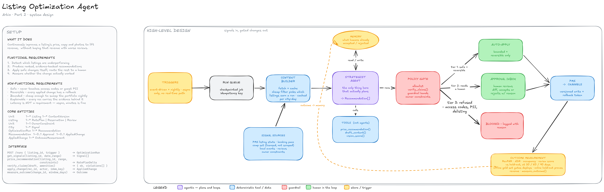

# Product Engineering Case Starter

This is a small starter repo for Arbio's product-engineering case interview. It gives you a working React app with a mocked reservation page and a placeholder create-case panel.

## Goal

Improve the `Create case` interaction for an ops agent who is working from a reservation context.

The starter already includes:

- a reservation page wireframe
- mock reservation, guest, payment, message, and access context
- an `Add case` button
- a placeholder side panel where the create-case flow should live
- plain CSS with no Tailwind setup


## Starter wireframe

The starter app intentionally uses a simple mocked reservation page, not a real Arbio page.


## Setup

```bash
pnpm install
pnpm dev
```

Open the local URL printed by Vite.

## What to build

Create an interaction prototype for the case creation flow. The first slice should show:

1. Reservation context remains visible or recoverable.
2. The create-case surface opens from the `Add case` button.
3. Useful fields are prefilled from the current context.
4. Case type and priority can be suggested or selected.
5. There is a loading state while suggested actions are generated.
6. There is a success state after the case is created.

## What not to build

Do not spend time on:

- real backend calls
- authentication
- real smart-lock lookups
- real task generation logic
- exact Arbio design-system fidelity
- production persistence
- Slack, Booking.com, Airbnb, or Typeform integrations

Mock anything you need.

## Deliverable

At the end of the session, share this repository with your changes and add a short note below.

## Candidate note

1. **How to run or open it**

   ```bash
   pnpm install
   pnpm dev
   ```

   Open the printed local URL. Append `?actionPlanDelayMs=<ms>` to shorten
   the suggested-actions delay for a live demo — the default is the real
   ~14s, not a shortcut around it.

2. **What I built**

   Two product bets, not a feature list — everything else exists to make
   these real:

   - Suggested-actions generation starts the moment the panel opens, not on
     submit. The time an agent spends reading the prefill and adjusting the
     description absorbs most of the wait (an assumption, see below, not a
     measurement).
   - Case creation never waits on that generation. The case is created
     immediately; the action plan attaches wherever it currently exists —
     the panel's success view, then the Open Cases card once the panel is
     closed — loading and success in the reverse of the order the brief
     lists them in, deliberately.

   The six required states, suggested classification with visible
   reasoning, the masked access code, and the accessibility work all exist
   in service of those two bets. Full reasoning for each individual call is
   in `DECISIONS.md`, not repeated here.

3. **Tradeoffs I made**

   - Only one case at a time (`createdCase: Case | null`, not a list) — a
     second case would need its own action-plan tracking, since there's
     exactly one generation slot in the app. Creating again replaces the
     first case rather than adding a second.
   - No persistence. Title and description reset the moment the panel
     closes; nothing survives a page reload. There's no backend to persist
     to.
   - The eager-generation bet assumes the panel is opened with intent and
     abandoned rarely. That's an assumption I made, not something measured
     against real agent behavior.

4. **What I'd improve with 2 more hours**

   - Persist the draft (title/description) so an accidental close doesn't
     lose typed edits.
   - Support more than one open case per reservation — needs per-case
     action-plan tracking instead of the current singular slot.
   - A real failure/retry path for suggested-action generation; right now
     the mock always succeeds.
   - Regenerate the plan if the agent substantially edits the description
     before it resolves — it's currently keyed only on type/priority.

5. **What's needed before shipping this in production**

   Access codes never enter the case title or description in this build —
   masked by default with an explicit reveal, never concatenated into a
   text field that could end up in a notification, export, or email. Before
   production that needs to go further than client-side UI discipline:

   - An audit log on every reveal (who, when, which case) — there is none
     right now.
   - Server-side redaction: the code shouldn't reach the client at all until
     an authorized reveal request, not just be hidden in the UI after
     being delivered.
   - A real backend, persistence, and auth/access control around who can
     create cases or reveal codes.
   - Real task-generation logic behind the action plan, and real handling
     for when it fails.

**Time and AI use:** roughly three hours of building plus review time, with
Claude Code doing most of the typing under close direction. The commit
history includes fixes where it caught its own contradictions (moving the
action-plan hook after first placing it somewhere that broke the exact bet
it was supposed to prove) and fixes after I caught others (a dead-end
reopen state, radio semantics with no keyboard behavior behind them).
Nothing here shipped without being read line by line.

## Part 2 — Listing Optimization Agent

Done. Full write-up, requirements, flow, the design decisions I'd defend, evaluation plan, and what I'd ship first: [`docs/listing-optimization-agent.md`](docs/listing-optimization-agent.md).

Diagram: [Excalidraw board](https://excalidraw.com/#json=wFVpSjvRmlwZiJ-H77ut0,XdZ9WevMuHs7-G2CkMjXJg) (live, editable) — static export below.


